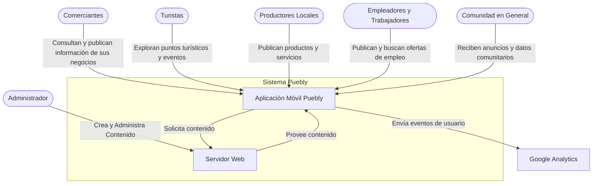
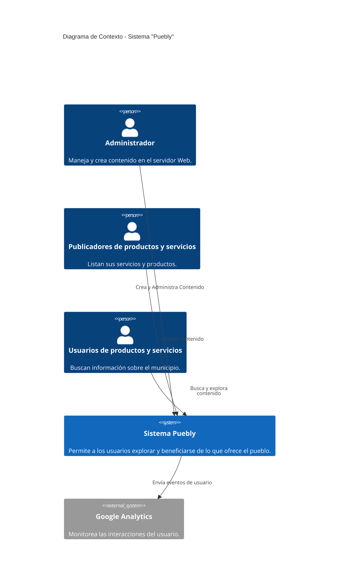
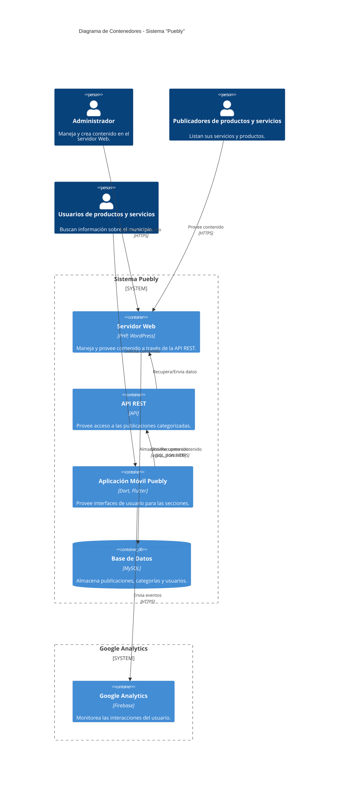

# Modelo C4

## Diagrama de Contexto

El Diagrama de Contexto presenta una vista de alto nivel del sistema **Puebly**, mostrando las interacciones entre el sistema y los diferentes actores. El objetivo es ofrecer una visión clara de cómo los usuarios y otros sistemas externos interactúan con **Puebly**.

### Descripción General
El sistema **Puebly** es una plataforma que permite a los campesinos y comerciantes realizar publicaciones de sus productos y servicios locales. La información se presenta organizada en distintas secciones, como comercio, turismo, empleos, anuncios, comunidad, entre otras, para facilitar la obtención de información por parte de turistas y usuarios interesados en el municipio. El sistema está compuesto por dos componentes principales:

1. **Servidor Web**: Utilizado para crear y categorizar publicaciones relacionadas con los municipios.
2. **Aplicación Móvil Puebly**: Consume contenidos del servidor a través de una API REST y está integrada con Google Analytics mediante Firebase para monitorear estadísticas de uso.

El sistema externo **Google Analytics** recopila estadísticas sobre el uso de la aplicación y las visualizaciones de las publicaciones, proporcionando métricas que aseguran a los publicadores la visibilidad de sus contenidos.

### Actores 

- **Administrador**: Usuario responsable de gestionar el contenido en el servidor Web.
- **Publicadores de productos y servicios**: Habitantes de los municipios que realizan publicaciones de bienes y servicios específicos para un municipio.
    - **Comerciantes**: Dueños de negocios locales interesados en listar sus productos y servicios.
    - **Empleadores**: Personas que buscan contratar personal.
    - **Productores Locales**: Personas que producen bienes agrícolas y artesanales que desean visibilidad para sus productos.
    - **Entidades públicas**: Órganos del gobierno que publican información relacionada con el municipio.
- **Usuarios de productos y servicios**: Personas que buscan información sobre el municipio.
    - **Trabajadores**: Habitantes del municipio en busca de empleo.
    - **Turistas**: Personas que visitan el municipio y buscan información sobre puntos de interés turístico y servicios.
    - **Comunidad en General**: Habitantes del municipio interesados en anuncios comunitarios, servicios públicos, horarios, convocatorias, datos históricos y otros aspectos relevantes.

### Interacciones 

- El **Administrador** interactúa con el sistema **Puebly** a través del **Servidor Web** para crear y administrar publicaciones, categorías y otros contenidos relacionados con el municipio.
- Los **Publicadores de productos y servicios** interactúan con el sistema **Puebly** para realizar publicaciones relacionadas con el municipio.
- Los **Usuarios de productos y servicios** acceden al sistema **Puebly** para obtener información relevante a través de las diferentes secciones ofrecidas (Comercio, Turismo, Plaza, Empleo, Anuncios, Comunidad, Sabías que) utilizando la **Aplicación Móvil Puebly**.
- La **Aplicación Móvil Puebly** se comunica con el **Servidor Web** utilizando una API REST para obtener las publicaciones categorizadas según el ID de las categorías, mostrando esta información filtrada y organizada según la sección correspondiente.
- La **Aplicación Móvil Puebly** utiliza los servicios de **Google Analytics** proporcionados por Firebase para rastrear y monitorear la interacción del usuario con las publicaciones, garantizando a los publicadores que sus publicaciones están siendo visualizadas.

## Diagrama de Contenedores

El Diagrama de Contenedores proporciona una visión de alto nivel de los diferentes contenedores que forman parte del sistema **Puebly**, ilustrando cómo se comunican e interactúan entre ellos. Los contenedores principales en nuestro sistema son:

1. **Aplicación Móvil Puebly**: Interfaz de usuario que interactúa con el servidor para obtener contenido.
2. **API REST**: Interfaz a través de la cual la aplicación móvil accede a la información de WordPress.
3. **Servidor Web**: CMS utilizado para crear y gestionar posts categorizados. Aloja la API REST.
4. **Base de Datos**: Base de datos relacional que almacena las publicaciones y otros datos de contenido generados en WordPress.

### Contenedores

#### **Aplicación Móvil Puebly**
  - **Descripción**: Front-end que consume la API REST del servidor Web para mostrar información categorizada.
  - **Tecnología**: Dart, Flutter, Riverpod.
  - **Responsabilidades**: Proveer interfaces de usuario para las secciones de Comercio, Turismo, Plaza, Empleo, Anuncios, Comunidad y Sabías que ofrece cada municipio.
    - ✅ Interactuar con la API REST del servidor Web.
    - ✅ Visualizar las publicaciones según la categoría.
    - ✅ Monitorear las visualizaciones de las publicaciones.
    - ✅ Monitorear la interacción del usuario con el botón de llamada de la publicación.
    - ✅ Monitorear la interacción del usuario con el botón de WhatsApp de la publicación.
    - ✅ Monitorear la interacción del usuario con el botón de ubicación de la publicación.
    - 🔲 Implementar autenticación segura y gestión de tokens.

#### **API REST**
  - **Descripción**: Interfaz programática expuesta por el servidor Web.
  - **Tecnología**: PHP, WordPress.
  - **Responsabilidades**: Proveer los endpoints necesarios para que la Aplicación Móvil Puebly obtenga el contenido según las diferentes categorías.
    - ✅ Proveer lista de municipios.
    - ✅ Proveer las publicaciones más recientes por municipio.
    - ✅ Proveer las publicaciones por categoría.
    - ✅ Proveer las categorías.

#### **Servidor Web**
  - **Descripción**: Almacena y gestiona el contenido publicado por administradores y publicadores.
  - **Tecnología**: PHP, WordPress.
  - **Responsabilidades**: Gestionar el contenido de WordPress.
    - ✅ Crear y gestionar publicaciones.
    - ✅ Crear y gestionar categorías.
    - ✅ Crear y gestionar usuarios.
    - ✅ Proveer el contenido a través de la API REST.

#### **Base de Datos**
  - **Descripción**: Base de datos relacional que almacena todas las publicaciones, categorías y usuarios relacionados.
  - **Tecnología**: MySQL.
  - **Responsabilidades**: Persistir y organizar datos para su rápida recuperación por el servidor Web.

#### **Google Analytics**
  - **Descripción**: Servicio de rastreo de datos de Google para monitorear las interacciones del usuario con los contenidos.
  - **Tecnología**: Google Firebase.
  - **Responsabilidades**: Registrar las interacciones del usuario con la aplicación.

### Interacciones
- Los **Usuarios de productos y servicios** acceden a la **Aplicación Móvil Puebly** para explorar y beneficiarse de los contenidos.
- La **Aplicación Móvil Puebly** interactúa con la **API REST** para obtener y mostrar el contenido.
- El **Servidor Web** se comunica con la **Base de Datos** para almacenar y recuperar datos.
- El **Administrador** y los **Publicadores de productos y servicios** interactúan con el **Servidor Web** para crear y gestionar contenido.
- **Google Analytics** recopila y analiza los eventos e interacciones de los usuarios para generar métricas.
